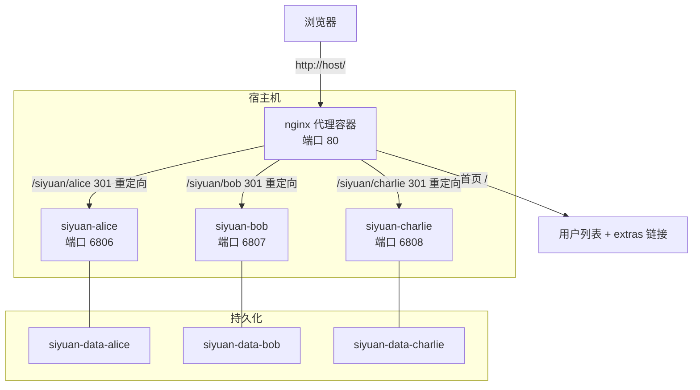
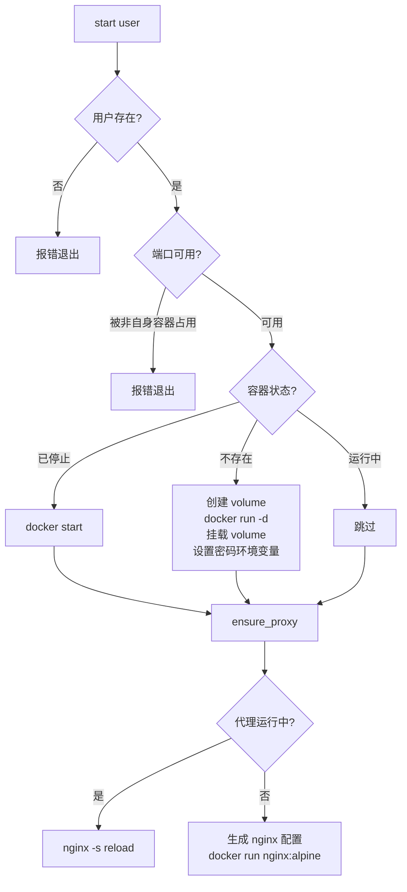
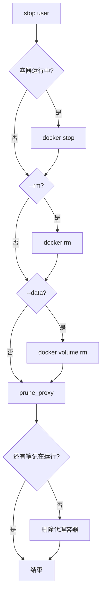
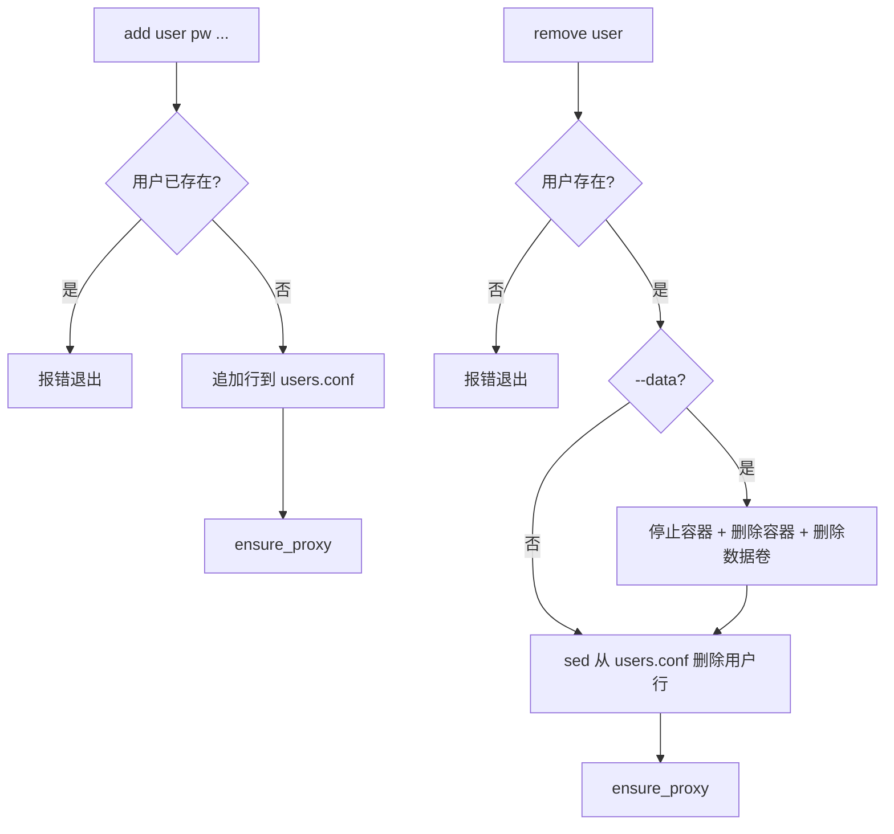
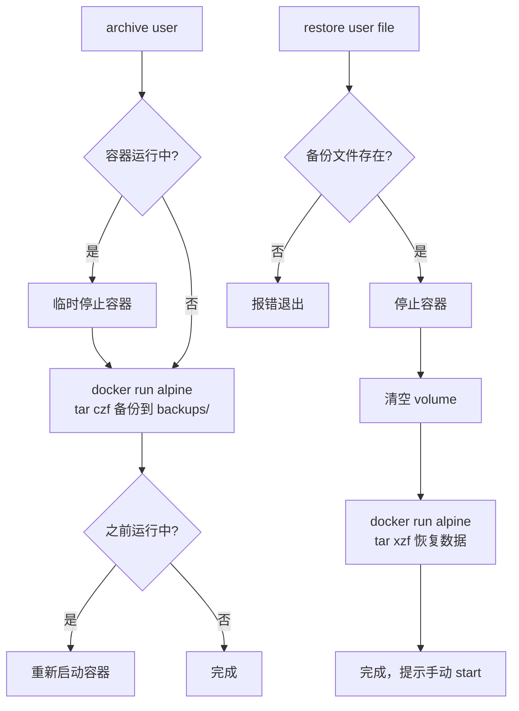

思源笔记多用户 Docker 管理脚本，用于多人共享同一台服务器运行思源笔记。兼容 Linux 和 macOS。

**运行环境**：CentOS 7 服务器，**开发环境**：macOS。

## 架构



每个用户独立容器 + 独立 Docker volume，通过 nginx 统一入口访问。思源不支持子路径部署，因此 nginx 用 301 重定向到各自端口，而非反向代理。

## 文件结构

- `siyuan-manager.sh` — 主管理脚本
- `users.conf` — 用户配置（由 `users.conf.example` 复制，权限 600）
- `extras.conf` — 额外服务/链接配置（由 `extras.conf.example` 复制）
- `test.sh` — 测试脚本（mock Docker 命令）
- `index.md` — 首页 Markdown 内容（可选）
- `images/` — 离线镜像 tar（linux/amd64）

## 配置文件格式

```
# users.conf — username:password[:port[:image[:display_name]]]
alice:pass123
bob:bob456:6810
charlie:mypw:6812:custom/siyuan:v3
eve:pass:::Eve的笔记

# extras.conf — 标签:端口[:路径] 或 标签:URL
监控面板:8080
文件管理:9000:/files
外部服务:https://example.com/api
```

## 命令

| 命令 | 说明 |
|------|------|
| `start <user\|all>` | 启动容器（自动创建 nginx 代理） |
| `stop <user\|all> [--rm] [--data]` | 停止容器（--rm 删除容器，--data 同时删除数据卷） |
| `restart <user\|all>` | 重启容器 |
| `status` | 查看运行状态 |
| `list` | 列出用户及访问地址 |
| `archive <user\|all>` | 备份数据到 `backups/` |
| `restore <user> <file>` | 从备份文件恢复 |
| `archives` | 列出备份文件 |
| `add <user> <pw> [port] [img] [name]` | 添加用户 |
| `remove <user> [--data]` | 移除用户（--data 同时清理数据卷） |

## 核心流程

### start



### stop



### add / remove



### archive / restore



## nginx 代理

- 自动生命周期：首个笔记启动时创建代理容器，所有笔记停止后自动删除
- 配置热更新：代理已运行时通过 `nginx -s reload` 重载，无需重启
- 首页 `/` 展示用户列表和 extras 链接，支持 `index.md` 自定义内容
- `/siyuan/{user}` 301 重定向到对应端口（思源不支持子路径部署）
- 代理容器挂载 `nginx/nginx.conf` 和 `nginx/index.html`，CentOS 7 需 `:z` SELinux 标签

## 环境变量

| 变量 | 说明 |
|------|------|
| `SIYUAN_CONFIG_FILE` | 覆盖用户配置文件路径 |
| `SIYUAN_EXTRAS_FILE` | 覆盖 extras 配置文件路径 |
| `SIYUAN_BACKUP_DIR` | 覆盖备份目录路径 |

## 跨平台兼容

- `sed` 使用 `> tmp && mv` 代替 `-i`（BSD/GNU 差异）
- 正则统一 `-E`，空格匹配用 `[[:space:]]` 不用 `\s`
- 配置读取用进程替换 `< <(cmd)` 而非管道，避免 bash 4.2 子 shell 问题
- 哈希用 `cksum`（POSIX），不依赖 `md5`/`md5sum`
- `.gitattributes` 强制 `.sh` 文件 LF 换行
